# KỊCH BẢN DEMO PILOT
## Hệ thống Quản lý Chương trình Quốc gia về Xúc tiến Thương mại (XTTMQG)

> Phiên bản: 1.0 — POC 2026
> Đối tượng: Trình diễn cho Bộ Công Thương — Cục Xúc tiến Thương mại

## I. MỤC ĐÍCH KỊCH BẢN

Trình diễn vòng đời đầy đủ của một đề án Xúc tiến Thương mại quốc gia, đi qua **8 vai trò** trên hệ thống — từ lúc **Ban quản lý phát động chu kỳ năm** cho đến khi **đề án được nghiệm thu và quyết toán**. Sau khi hoàn tất kịch bản, khách hàng sẽ thấy:

1. Hệ thống bao phủ đầy đủ 27 bước quy trình tổ chức Chương trình XTTM cấp quốc gia.
2. Phân tách trách nhiệm rõ ràng: mỗi vai trò chỉ làm phần việc của mình, không ai làm thay được.
3. Dữ liệu chảy liên tục giữa các vai trò (đề án → hồ sơ → quyết định → hợp đồng → báo cáo → biên bản → phiếu chi).
4. Các cơ chế cảnh báo SLA, tenant isolation, audit log đều có thật.

**Thời lượng dự kiến**: 35–45 phút (đã chuẩn bị mock data sẵn để có thể bỏ qua bước nhập liệu dài).

## II. CHUẨN BỊ TRƯỚC KHI DEMO

### 2.1. Reset dữ liệu mẫu

```bash
npm run db:reset    # drop + push + seed
npm run dev         # dev server, port 3000
```

Dữ liệu mẫu đã có:

- Chu kỳ năm 2025 (`COMPLETED`) + 2026 (`OPEN_REGISTRATION`)
- 8 đề án ở các trạng thái khác nhau cover từng giai đoạn
- 8 tài khoản hardcoded (xem mục 2.2)
- File mẫu PDF/Excel trong `public/mock-files/`

### 2.2. Tài khoản demo

| Vai trò | Username | Mật khẩu | Đơn vị | Mục đích trong kịch bản |
|---|---|---|---|---|
| Quản trị viên | `admin` | `Admin@123` | — | Cấu hình ma trận quyền, audit log |
| Ban quản lý CT XTTM | `banql` | `Banql@123` | Cục XTTM | Tiếp nhận, phân công, ra quyết định, sinh HĐ, nghiệm thu |
| Chuyên viên kiểm tra | `chuyenvien` | `Cv@123` | Cục XTTM | Kiểm tra format + chấm điểm sơ bộ |
| Hội đồng thẩm định | `hoidong` | `Hd@123` | Hội đồng năm | Chấm phiếu thẩm định |
| Lãnh đạo | `lanhdao` | `Ld@123` | Bộ Công Thương | Ký quyết định phê duyệt |
| Tài chính | `taichinh` | `Tc@123` | Cục XTTM | Tạm ứng, thanh toán, quyết toán |
| Đơn vị chủ trì #1 | `donvi1` | `Donvi@123` | Hiệp hội Da giày VN | Nộp đề án, ký HĐ, nộp báo cáo |
| Đơn vị chủ trì #2 | `donvi2` | `Donvi@123` | Hiệp hội Dệt may VN | Demo tenant isolation |

### 2.3. Quy ước screenshot

Mỗi bước có 1 hoặc nhiều ảnh chụp màn hình. Đặt ảnh trong thư mục `docs/screenshots/` theo tên file gợi ý ở từng bước. Khi xuất file `.docx`, các ảnh sẽ tự động được embed.

> 💡 **Tip**: Chụp ở độ phân giải 1920×1080. Nén PNG để giảm dung lượng. Có thể dùng phần mềm Snipping Tool (Windows) hoặc CleanShot/Skitch để khoanh đỏ điểm cần chú ý.

## III. TỔNG QUAN LUỒNG NGHIỆP VỤ

```
       ┌─────────────────────────────────────────────────────────┐
       │              PHẦN A — KHỞI TẠO CHU KỲ                    │
       │  banql  →  Tạo chu kỳ → Cấu hình → Mở đăng ký          │
       └─────────────────────────────────────────────────────────┘
                              ↓
       ┌─────────────────────────────────────────────────────────┐
       │              PHẦN B — NỘP ĐỀ ÁN                          │
       │  donvi1  →  Khai báo 6 bước → Nộp                        │
       └─────────────────────────────────────────────────────────┘
                              ↓
       ┌─────────────────────────────────────────────────────────┐
       │              PHẦN C — TIẾP NHẬN & KIỂM TRA               │
       │  banql      →  Tiếp nhận → Phân công                     │
       │  chuyenvien →  Kiểm tra format → Chấm điểm sơ bộ         │
       └─────────────────────────────────────────────────────────┘
                              ↓
       ┌─────────────────────────────────────────────────────────┐
       │              PHẦN D — THẨM ĐỊNH & PHÊ DUYỆT              │
       │  banql   →  Lập hội đồng                                 │
       │  hoidong →  Chấm phiếu thẩm định                         │
       │  banql   →  Tổng hợp điểm, lập tờ trình                  │
       │  lanhdao →  Ký quyết định                                │
       └─────────────────────────────────────────────────────────┘
                              ↓
       ┌─────────────────────────────────────────────────────────┐
       │              PHẦN E — HỢP ĐỒNG & TRIỂN KHAI              │
       │  banql    →  Sinh HĐ tự động → Upload bản scan           │
       │  donvi1   →  Cập nhật kế hoạch triển khai                │
       │  taichinh →  Phiếu tạm ứng                               │
       └─────────────────────────────────────────────────────────┘
                              ↓
       ┌─────────────────────────────────────────────────────────┐
       │              PHẦN F — BÁO CÁO & NGHIỆM THU               │
       │  donvi1   →  Nộp báo cáo kết quả                         │
       │  banql    →  Duyệt báo cáo                               │
       │  banql    →  Lập biên bản nghiệm thu → Thanh lý HĐ       │
       │  taichinh →  Phiếu thanh toán cuối → Quyết toán          │
       └─────────────────────────────────────────────────────────┘
                              ↓
       ┌─────────────────────────────────────────────────────────┐
       │              PHẦN G — DEMO PHỤ TRỢ                       │
       │  donvi2 →  Verify tenant isolation                       │
       │  admin  →  Phân quyền động + Audit log                   │
       └─────────────────────────────────────────────────────────┘
```

# PHẦN A — KHỞI TẠO CHU KỲ CHƯƠNG TRÌNH

## Bước A.1 — Ban quản lý đăng nhập & vào module Chu kỳ chương trình

**Tài khoản**: `banql / Banql@123`

**Mục tiêu nghiệp vụ**: Bắt đầu năm mới, BQL phát động một chu kỳ chương trình XTTM mới — đây là điều kiện tiền đề để mọi đề án được nộp.

**Thao tác**:

1. Mở trình duyệt vào `http://localhost:3000/login`
2. Nhập `banql` / `Banql@123` → bấm **Đăng nhập**
3. Sau khi vào dashboard, click menu **Quản lý → Chu kỳ chương trình** (sidebar trái)

**Kết quả mong đợi**: Hiển thị danh sách chu kỳ năm trước (2025) và 2026 (nếu seed đã tạo).

**Ảnh chụp**:
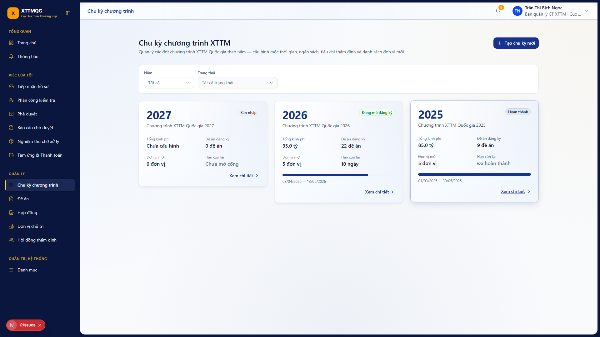

## Bước A.2 — Tạo chu kỳ năm mới

**Tài khoản**: `banql`

**Thao tác**:

1. Tại trang Chu kỳ chương trình, bấm nút **+ Tạo chu kỳ mới**
2. Form mở ra — điền các trường:
   - Tên chu kỳ: `Chương trình XTTMQG năm 2026`
   - Năm: `2026`
   - Hạn nộp đề án: `30/05/2026`
   - Tổng ngân sách: `200,000,000,000` VNĐ
   - Mô tả: ngắn gọn 1-2 dòng
3. Bấm **Lưu nháp**

**Kết quả mong đợi**: Chu kỳ mới được tạo ở trạng thái `DRAFT` (Bản nháp).

**Ảnh chụp**:


## Bước A.3 — Cấu hình chi tiết chu kỳ

**Tài khoản**: `banql`

**Mục tiêu nghiệp vụ**: Cấu hình các thông số cần thiết để đơn vị có thể nộp đề án và hội đồng có cơ sở chấm điểm.

**Thao tác**:

1. Mở chu kỳ vừa tạo → các tab cấu hình:
   - **Tab Mốc thời gian** — đặt: ngày mở đăng ký, ngày đóng đăng ký, ngày họp hội đồng dự kiến, ngày ra quyết định
   - **Tab Tiêu chí thẩm định** — kéo thả các tiêu chí từ danh mục (đã seed sẵn 8 tiêu chí với trọng số), tổng trọng số = 100%
   - **Tab Mẫu công văn** — chọn mẫu công văn mời + mẫu email thông báo (đã seed sẵn)
   - **Tab Đơn vị mời** — tick chọn các Hiệp hội/Doanh nghiệp được mời tham gia (đã có ~10 đơn vị mock)
2. Sau khi cấu hình xong → bấm **Lưu cấu hình**

**Kết quả mong đợi**: Tất cả các tab đều có ✓ "Đã hoàn thiện".

**Ảnh chụp**:

- 
- 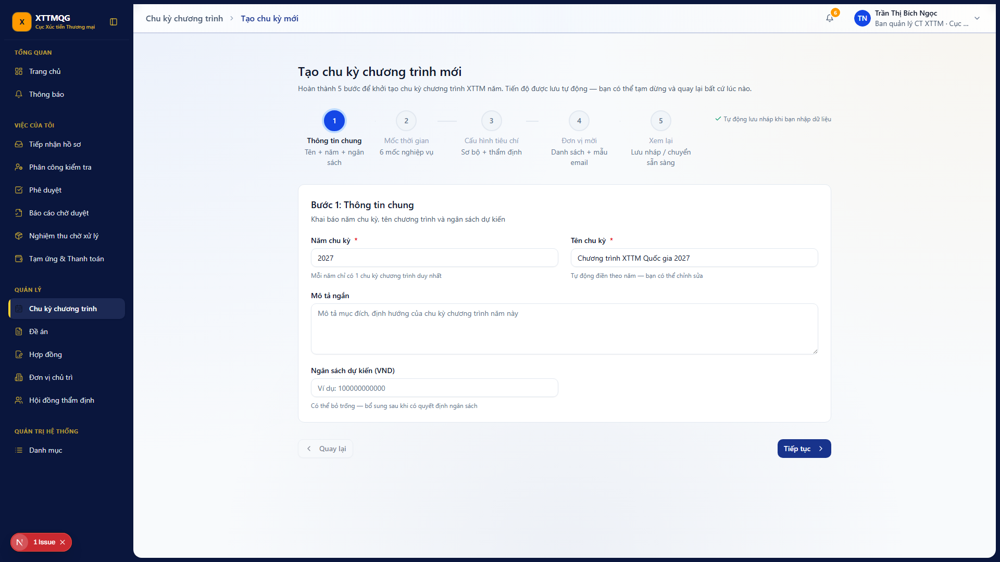
- 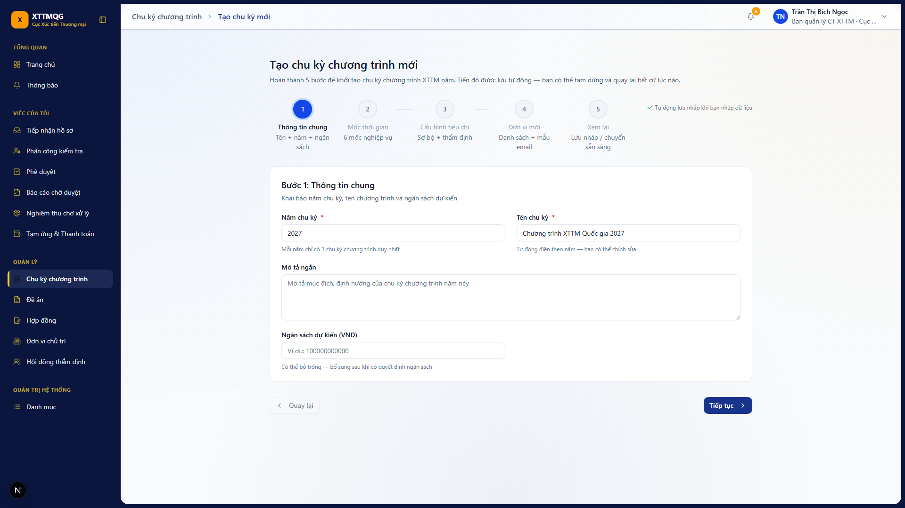

## Bước A.4 — Mở đăng ký + gửi email mời các đơn vị

**Tài khoản**: `banql`

**Mục tiêu nghiệp vụ**: Chuyển trạng thái chu kỳ sang `OPEN_REGISTRATION` để các đơn vị chủ trì có thể nộp đề án; đồng thời composer email gửi thông báo hàng loạt.

**Thao tác**:

1. Tại trang chi tiết chu kỳ, bấm nút **Mở đăng ký**
2. Dialog xác nhận hiện ra → bấm **Xác nhận mở đăng ký**
3. Hệ thống tự động chuyển status `DRAFT → OPEN_REGISTRATION`
4. Bấm tiếp nút **Soạn email mời** → composer mở ra với:
   - Tiêu đề: `Mời tham gia Chương trình XTTMQG năm 2026`
   - Nội dung HTML có sẵn template — biên tập nếu cần
   - Danh sách người nhận: tự động lấy từ Tab Đơn vị mời ở bước A.3
5. Bấm **Gửi tất cả** → hệ thống giả lập gửi email (POC: log vào DB, không gửi thực)

**Kết quả mong đợi**:

- Status chu kỳ = `OPEN_REGISTRATION` (badge xanh)
- Toast "Đã gửi N email mời"
- Lịch sử gửi email hiển thị ở tab Lịch sử

**Ảnh chụp**:

- 
- 
- 

# PHẦN B — ĐƠN VỊ NỘP ĐỀ ÁN

## Bước B.1 — Đơn vị đăng nhập, kiểm tra hồ sơ tổ chức

**Tài khoản**: `donvi1 / Donvi@123` (Hiệp hội Da giày VN)

**Mục tiêu nghiệp vụ**: Đơn vị chủ trì cần có hồ sơ tổ chức được duyệt trước khi nộp đề án. Demo điều này là điều kiện tiền đề.

**Thao tác**:

1. Đăng nhập với `donvi1`
2. Click menu **Quản lý → Hồ sơ tổ chức của tôi**
3. Kiểm tra trạng thái hồ sơ — nếu đã `APPROVED` (đã seed) thì xem qua các tab: Thông tin chung, Năng lực, Đầu mối liên hệ, Tài liệu

**Kết quả mong đợi**: Hồ sơ tổ chức ở trạng thái `APPROVED` — đủ điều kiện nộp đề án.

**Ảnh chụp**:
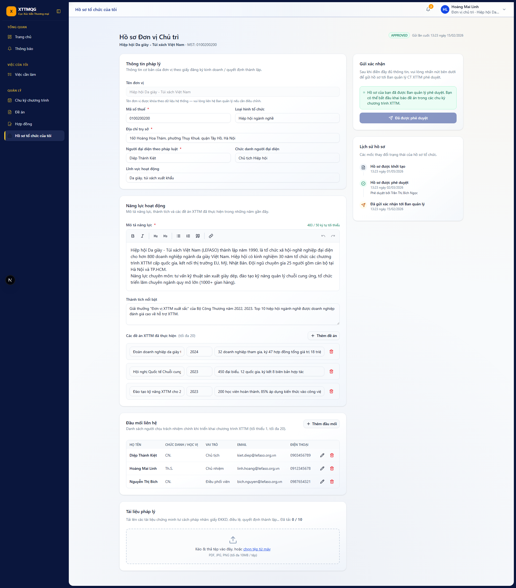

## Bước B.2 — Tạo đề án mới (wizard 6 bước)

**Tài khoản**: `donvi1`

**Mục tiêu nghiệp vụ**: Khai báo đầy đủ thông tin đề án qua wizard 6 bước, mỗi bước validate riêng.

**Thao tác**:

1. Click menu **Quản lý → Đề án**
2. Trang hiển thị **Submission Gate** xác nhận chu kỳ 2026 đang `OPEN_REGISTRATION` → nút **+ Tạo đề án mới** kích hoạt
3. Bấm **+ Tạo đề án mới** → mở wizard:
   - **Bước 1 — Thông tin chung**: Tên đề án "Hội chợ Quốc tế Da giày Việt Nam 2026", loại "Hội chợ XK", ngành hàng "Da giày", thị trường "EU + Bắc Mỹ", thời gian "Tháng 10/2026"
   - **Bước 2 — Mục tiêu**: nhập rich text mô tả mục tiêu + nội dung chính
   - **Bước 3 — Kế hoạch chi tiết**: bảng các đầu mục công việc với deliverable, deadline
   - **Bước 4 — Dự toán**: bảng dự toán đa dòng, có cột "Ngân sách Nhà nước" và "Đối ứng đơn vị"; tổng tự động: 5 tỷ VND
   - **Bước 5 — Chủ nhiệm đề án**: chọn từ danh sách contact của tổ chức
   - **Bước 6 — Tài liệu kèm theo**: upload PDF mô tả chi tiết, danh sách công ty tham gia
4. Mỗi bước có validation, click **Tiếp tục** để qua bước sau, hoặc **Quay lại** để sửa
5. Cuối cùng → **Lưu nháp** (status `DRAFT`)

**Kết quả mong đợi**: Đề án xuất hiện ở danh sách "Đề án của đơn vị" với status `DRAFT`.

**Ảnh chụp**:

- 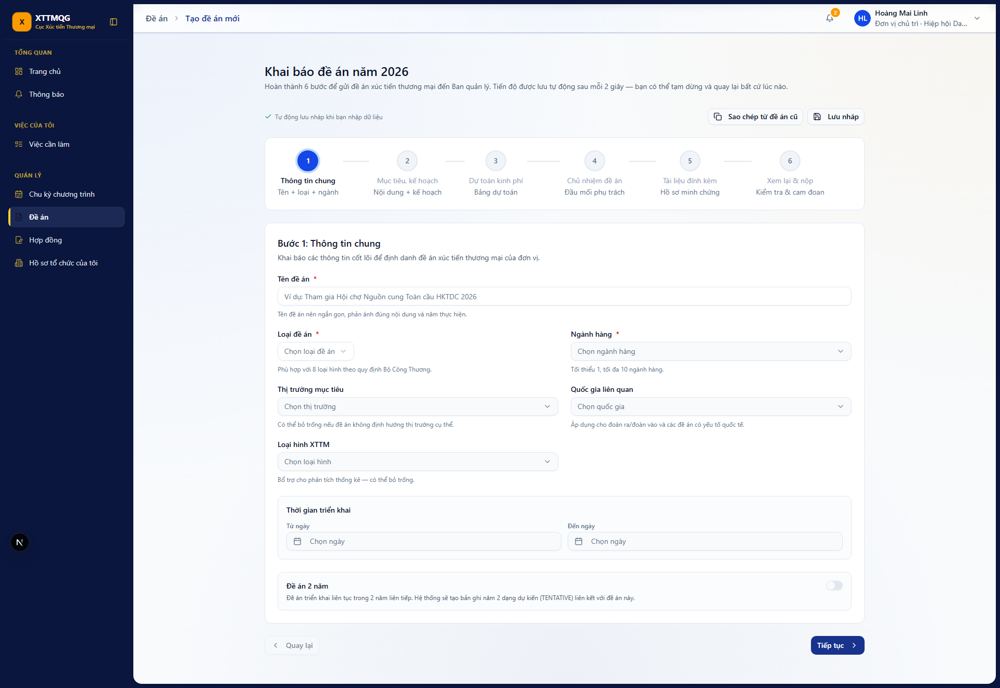
- 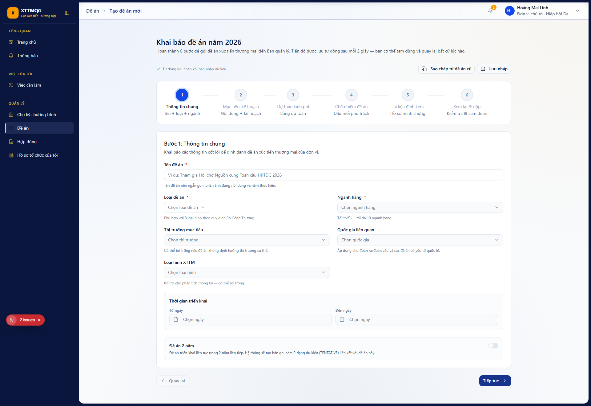
- 

## Bước B.3 — Nộp đề án

**Tài khoản**: `donvi1`

**Thao tác**:

1. Mở đề án nháp vừa tạo
2. Bấm nút **Nộp đề án**
3. Dialog xác nhận xuất hiện liệt kê 6 bước đã hoàn thiện → **Xác nhận nộp**

**Kết quả mong đợi**:

- Status đề án `DRAFT → SUBMITTED`
- Toast "Đã nộp đề án thành công"
- Đề án xuất hiện trong queue tiếp nhận của BQL

**Ảnh chụp**:

- 
- 

# PHẦN C — TIẾP NHẬN & KIỂM TRA

## Bước C.1 — BQL tiếp nhận hồ sơ

**Tài khoản**: `banql`

**Thao tác**:

1. Đăng nhập `banql`
2. Click menu **Việc của tôi → Tiếp nhận hồ sơ**
3. Thấy đề án vừa được nộp ở đầu danh sách (status `SUBMITTED`)
4. Click vào dòng → mở chi tiết → kiểm tra nhanh nội dung
5. Quay lại danh sách, bấm nút **Tiếp nhận** trên dòng đề án (hoặc tick chọn nhiều dòng + **Tiếp nhận hàng loạt**)

**Kết quả mong đợi**: Status `SUBMITTED → ASSIGNED` (Đã phân công - chờ chuyên viên).

**Ảnh chụp**:

- 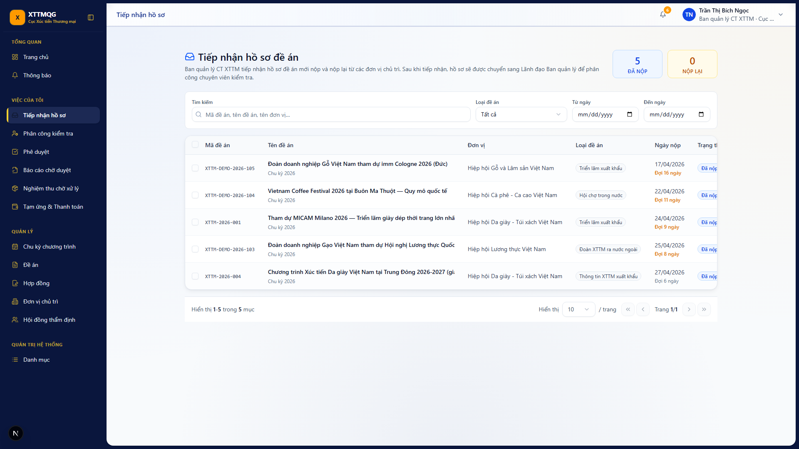
- 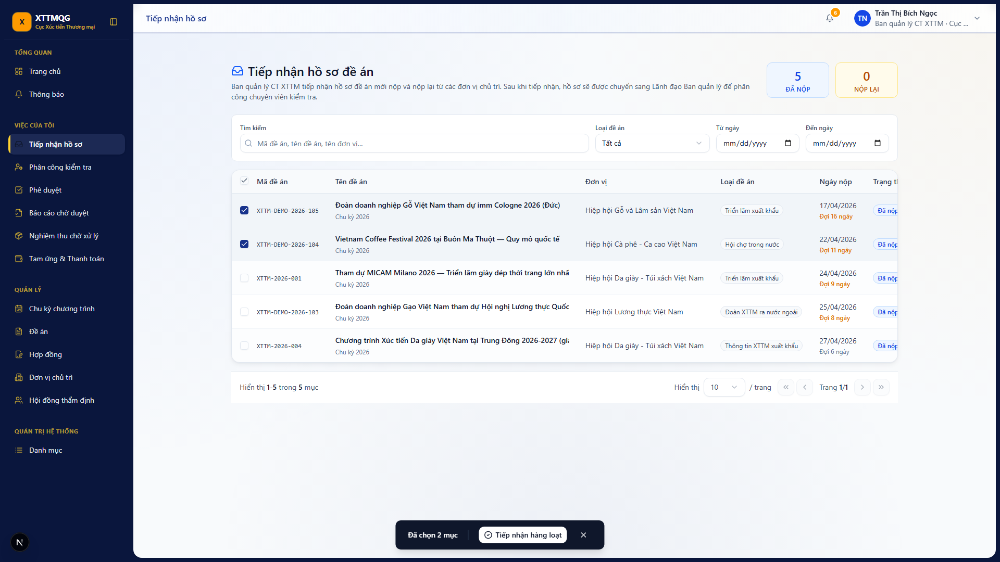

## Bước C.2 — BQL phân công chuyên viên kiểm tra

**Tài khoản**: `banql`

**Thao tác**:

1. Click menu **Việc của tôi → Phân công kiểm tra**
2. Đề án vừa tiếp nhận hiển thị ở queue
3. Bấm **Phân công** → modal hiện danh sách chuyên viên + workload hiện tại
4. Chọn `chuyenvien` → bấm **Xác nhận phân công**

**Kết quả mong đợi**:

- Status đề án `ASSIGNED → IN_REVIEW`
- Trường `assignedReviewerId` lưu user `chuyenvien`
- Notification gửi cho chuyên viên

**Ảnh chụp**:

- 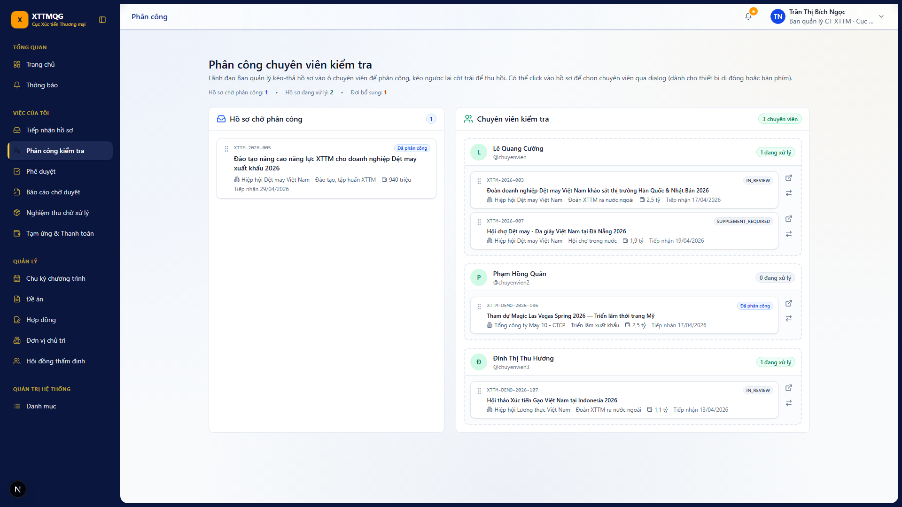
- 

## Bước C.3 — Chuyên viên kiểm tra hồ sơ hành chính

**Tài khoản**: `chuyenvien / Cv@123`

**Thao tác**:

1. Đăng nhập `chuyenvien` — landing page tự động vào `/kiem-tra`
2. Tab **Kiểm tra hành chính** đang active, thấy đề án vừa được giao
3. Click vào dòng → trang chi tiết kiểm tra hồ sơ
4. Đánh dấu checklist (5–7 mục): tài liệu pháp lý, dự toán, mục tiêu, kế hoạch, ký số... mỗi mục `✓ / ✗ / N/A` + ghi chú
5. Sau khi checklist đủ → bấm **Kết luận: Hợp lệ**

**Kết quả mong đợi**: Status `IN_REVIEW → VALID`, đề án xuất hiện ở tab "Chấm điểm sơ bộ".

> ℹ️ Demo edge case: Có thể bấm **Yêu cầu bổ sung** để chuyển status sang `SUPPLEMENT_REQUIRED`, đơn vị nhận thông báo và phải sửa nộp lại (`RESUBMITTED`). Sau đó quay lại chấm "Hợp lệ".

**Ảnh chụp**:

- 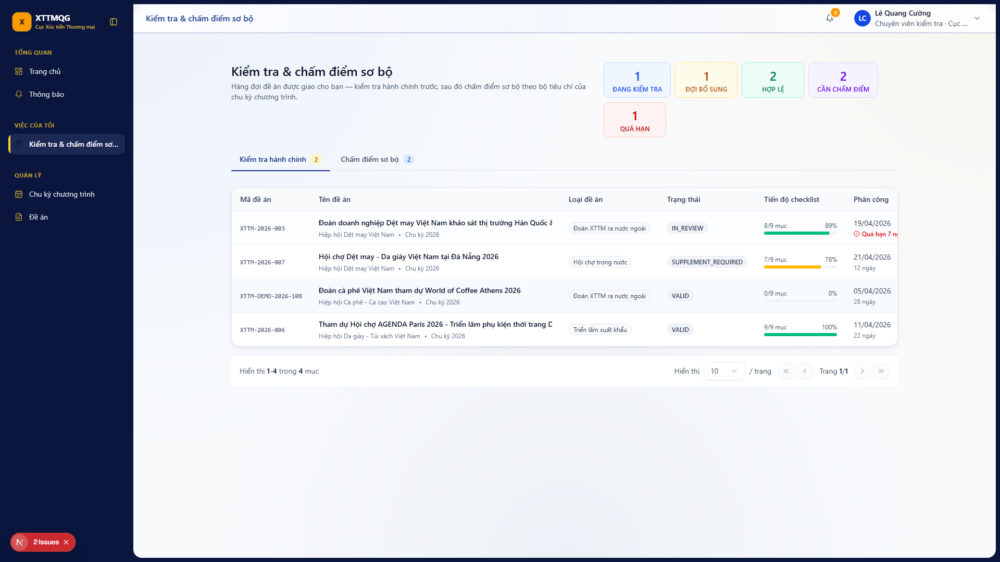
- 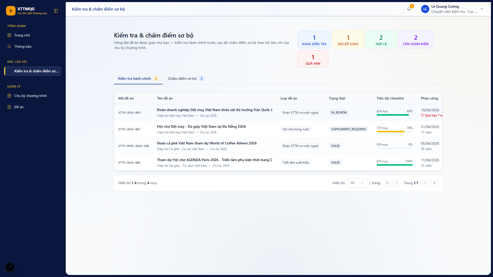

## Bước C.4 — Chuyên viên chấm điểm sơ bộ

**Tài khoản**: `chuyenvien`

**Thao tác**:

1. Tại `/kiem-tra`, chuyển sang **tab Chấm điểm sơ bộ**
2. Đề án vừa được mark "Hợp lệ" hiển thị ở queue
3. Click vào → trang chấm điểm hiển thị 8 tiêu chí của chu kỳ
4. Cho điểm từng tiêu chí (slider 0–10) + ghi chú nhận xét
5. Tổng điểm tự động tính theo trọng số
6. Bấm **Lưu nháp** (DRAFT) hoặc **Nộp phiếu** (SUBMITTED)

**Kết quả mong đợi**: ScoreSheet `kind=PRELIMINARY`, status `SUBMITTED`, totalScore tính sẵn.

**Ảnh chụp**:

- 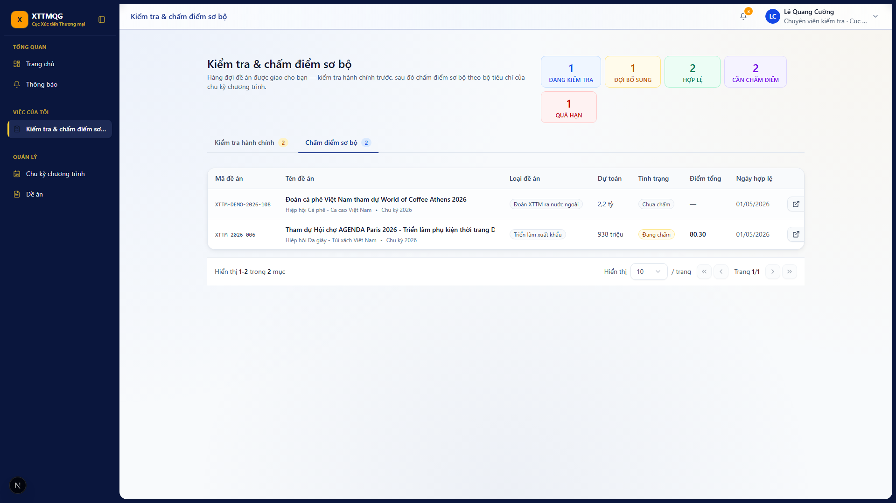
- 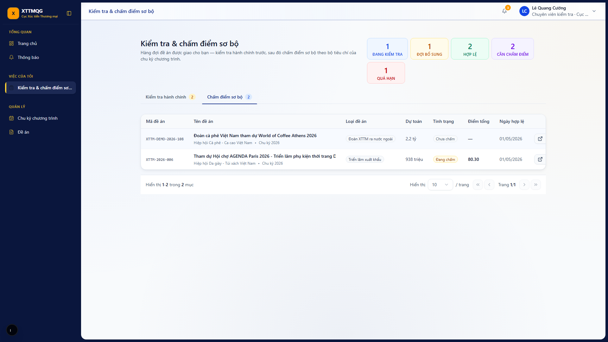

# PHẦN D — THẨM ĐỊNH & PHÊ DUYỆT

## Bước D.1 — BQL lập hội đồng thẩm định

**Tài khoản**: `banql`

**Thao tác**:

1. Click menu **Quản lý → Hội đồng thẩm định**
2. Bấm **+ Tạo hội đồng năm 2026**
3. Form điền: số quyết định thành lập, ngày, danh sách thành viên (chủ tịch + 4 ủy viên)
4. Lưu hội đồng → status `ACTIVE`
5. Vào tab **Phân công đề án** → tick chọn đề án vừa qua kiểm tra → **Gán cho hội đồng**

**Kết quả mong đợi**: Đề án có entry trong `ProjectCouncilAssignment`, status đề án `VALID → EVALUATING`.

**Ảnh chụp**:

- 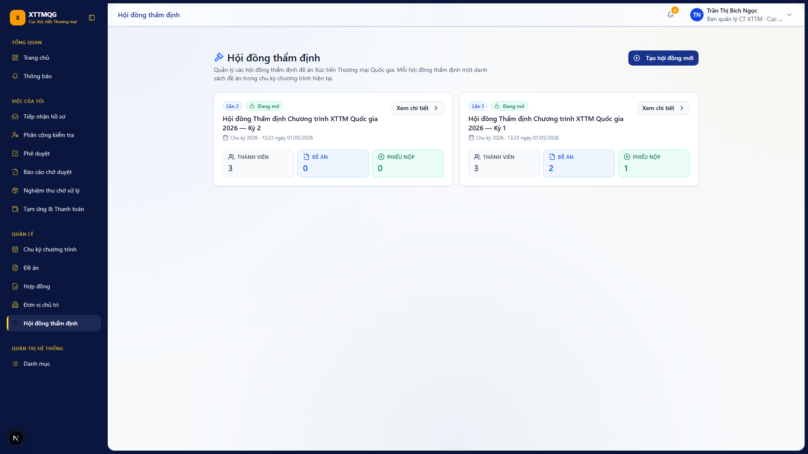
- 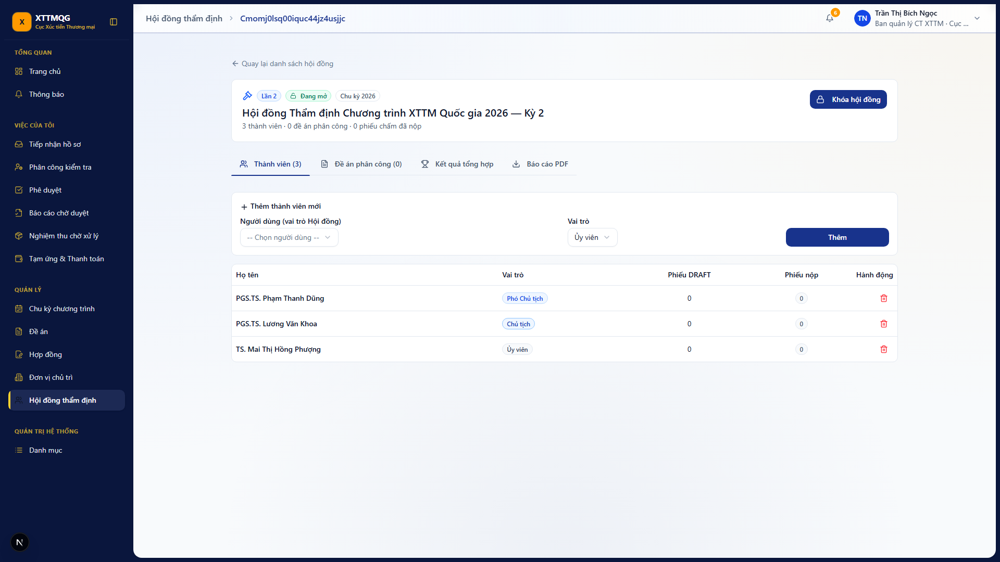

## Bước D.2 — Hội đồng chấm phiếu thẩm định

**Tài khoản**: `hoidong / Hd@123`

**Thao tác**:

1. Đăng nhập `hoidong` — landing tự động `/tham-dinh`
2. Thấy đề án trong queue thẩm định
3. Click vào → form chấm điểm hội đồng (cùng bộ tiêu chí, có thể thêm bình luận hội đồng)
4. Cho điểm + nhận xét + tích "không xung đột lợi ích"
5. **Nộp phiếu**

**Kết quả mong đợi**: ScoreSheet `kind=EVALUATION`, status `SUBMITTED`. Khi tất cả thành viên đã nộp → BQL có thể tổng hợp.

**Ảnh chụp**:

- 
- 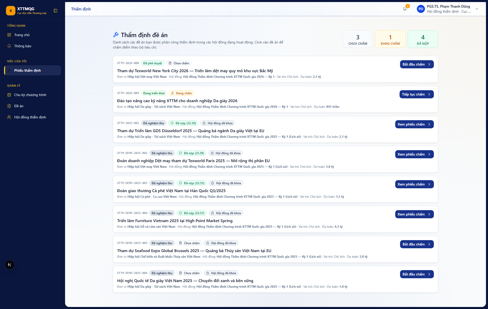

## Bước D.3 — BQL tổng hợp điểm + lập tờ trình

**Tài khoản**: `banql`

**Thao tác**:

1. Click menu **Việc của tôi → Phê duyệt**
2. Tab "Đề án chờ duyệt" hiển thị đề án vừa được chấm thẩm định
3. Click vào → trang chi tiết hiển thị:
   - Tổng điểm sơ bộ + điểm hội đồng (trung bình)
   - Bảng so sánh dự toán đề xuất vs đề xuất duyệt
   - Khu vực biên tập tờ trình (HTML editor)
4. Điều chỉnh ngân sách duyệt (nếu cần) + soạn tờ trình
5. Bấm **Trình lãnh đạo phê duyệt**

**Kết quả mong đợi**: Đề án chuyển vào queue chờ Lãnh đạo ký.

**Ảnh chụp**:

- 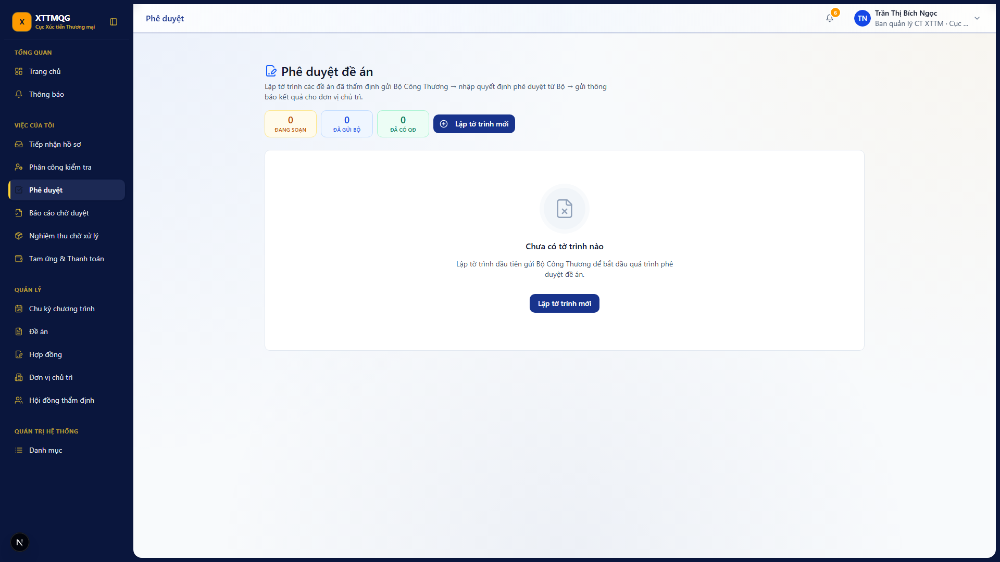

## Bước D.4 — Lãnh đạo ký quyết định phê duyệt

**Tài khoản**: `lanhdao / Ld@123`

**Mục tiêu nghiệp vụ**: Đây là vai trò DUY NHẤT có quyền `approve` đề án. Quyết định phê duyệt tự động sinh PDF.

**Thao tác**:

1. Đăng nhập `lanhdao`
2. Click menu **Việc của tôi → Phê duyệt** → thấy đề án ở queue chờ ký
3. Click vào → đọc tờ trình, xem điểm chi tiết
4. Có 2 lựa chọn:
   - **Ký quyết định phê duyệt** → form điền: Số QĐ, Ngày ký, Người ký, Chức vụ → bấm **Ký & xuất PDF**
   - **Trả về để chỉnh sửa** → ghi lý do
5. Sau khi ký, hệ thống sinh PDF Quyết định và đính kèm vào hồ sơ

**Kết quả mong đợi**:

- Status đề án `EVALUATING → APPROVED`
- File PDF QĐ tải về được, có ghi rõ số QĐ, ngày, người ký, ngân sách duyệt
- Notification gửi cho đơn vị chủ trì

**Ảnh chụp**:

- 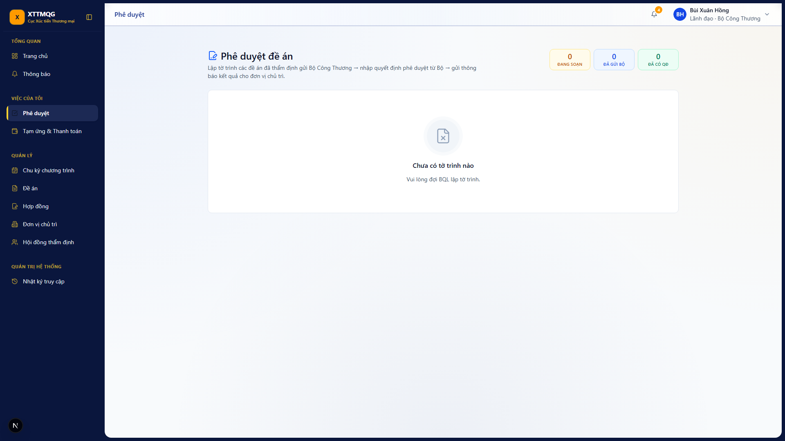
- 

# PHẦN E — HỢP ĐỒNG & TRIỂN KHAI

## Bước E.1 — BQL sinh hợp đồng tự động

**Tài khoản**: `banql`

**Mục tiêu nghiệp vụ**: Sau khi đề án được duyệt, hệ thống sinh hợp đồng theo template với số HĐ tự động.

**Thao tác**:

1. Click menu **Quản lý → Hợp đồng**
2. Tab "Đề án chưa có HĐ" hiển thị đề án vừa duyệt
3. Bấm **Sinh hợp đồng tự động** → hệ thống tạo bản nháp HĐ với:
   - Số HĐ: tự sinh `XTTM/2026/001`
   - Hai bên: Cục XTTM ↔ Hiệp hội Da giày VN
   - Tổng giá trị: lấy từ ngân sách duyệt
   - Điều khoản: theo template seed sẵn (rich text)
4. Biên tập điều khoản (nếu cần) → **Lưu**
5. Tải PDF HĐ → in ra ký tay 2 bên ngoài hệ thống → quay lại upload bản scan
6. Bấm **Upload bản scan đã ký** + nhập ngày ký

**Kết quả mong đợi**: Status HĐ `DRAFT → SIGNED`, có file scan.

> ℹ️ Cảnh báo SLA: Hệ thống cảnh báo nếu sau 60 ngày từ khi đề án `APPROVED` mà chưa có HĐ ký.

**Ảnh chụp**:

- 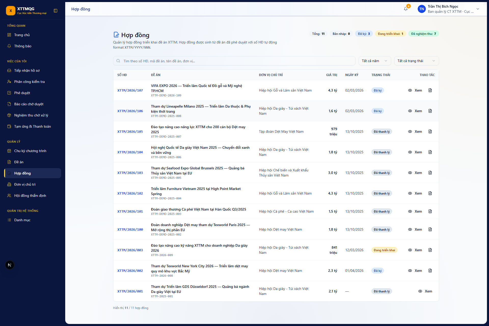
- 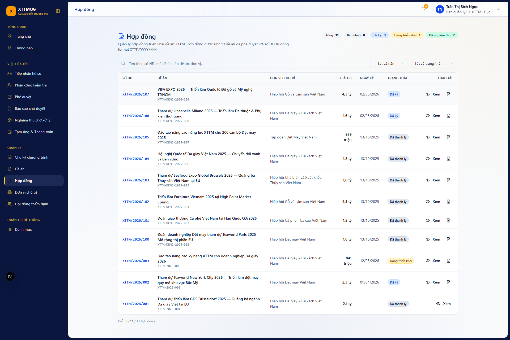

## Bước E.2 — Đơn vị cập nhật kế hoạch triển khai

**Tài khoản**: `donvi1`

**Thao tác**:

1. Đăng nhập `donvi1` → menu **Việc của tôi → Việc cần làm**
2. Thấy mục "Đề án vừa duyệt cần cập nhật kế hoạch triển khai"
3. Click → vào tab **Triển khai** trong `/de-an/[id]`
4. Cập nhật:
   - **Kế hoạch tiến độ** (milestones) — từng đầu mục, deadline, người phụ trách, % tiến độ
   - **Nhân sự thực hiện** — danh sách nhân sự + email/phone
   - **Liên hệ thương vụ ĐSQ** (BẮT BUỘC nếu là đề án quốc tế) — chọn quốc gia, tên đầu mối, ngày liên hệ, đính kèm văn bản
5. Bấm **Lưu kế hoạch**

> ℹ️ Cảnh báo SLA: Nếu trước sự kiện 30 ngày mà chưa có thông tin liên hệ thương vụ → cảnh báo đỏ trên dashboard BQL.

**Kết quả mong đợi**: Trường `contactedConsulate = true`, badge ✓ trên tab.

**Ảnh chụp**:

- 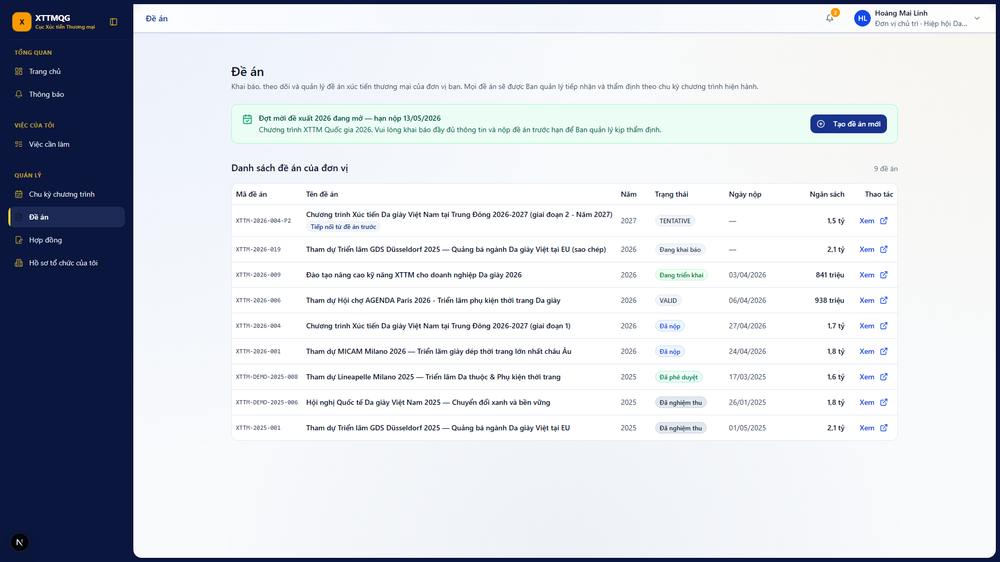
- 

## Bước E.3 — Tài chính phiếu tạm ứng

**Tài khoản**: `taichinh / Tc@123`

**Thao tác**:

1. Đăng nhập `taichinh` — landing `/tai-chinh`
2. Tab "Tạm ứng" → **+ Tạo phiếu tạm ứng**
3. Modal: chọn đề án (lọc đã ký HĐ), nhập số tiền tạm ứng (vd 30% giá trị HĐ), ngày dự kiến chi
4. **Lưu nháp** → status `DRAFT`
5. Bấm **Trình duyệt** → status `SUBMITTED`
6. (Nếu cần) admin/banql duyệt → status `APPROVED`
7. Bấm **Đã giải ngân** → status `DISBURSED`, ngày giải ngân ghi nhận

**Kết quả mong đợi**: Phiếu tạm ứng status `DISBURSED`, dashboard tài chính cập nhật tổng đã chi.

**Ảnh chụp**:

- 
- 

# PHẦN F — BÁO CÁO & NGHIỆM THU

## Bước F.1 — Đơn vị nộp báo cáo kết quả

**Tài khoản**: `donvi1`

**Bối cảnh**: Đề án đã thực hiện xong, đơn vị tổng kết kết quả.

**Thao tác**:

1. Đăng nhập `donvi1` → menu **Việc cần làm**
2. Thấy mục "Cần lập báo cáo kết quả"
3. Click → vào tab **Báo cáo** của đề án
4. Form báo cáo gồm 3 phần:
   - **Định lượng**: bảng các chỉ tiêu vs kết quả thực tế (số DN tham gia, số hợp đồng ký, doanh thu...)
   - **Định tính**: rich text mô tả kết quả, kinh nghiệm, đề xuất
   - **Số doanh nghiệp tham gia**: số nguyên — dùng để cảnh báo nếu thấp bất thường
5. Đính kèm file PDF báo cáo chi tiết
6. Bấm **Lưu nháp** → sau đó **Nộp báo cáo**

**Kết quả mong đợi**: Report status `DRAFT → SUBMITTED`, ngày nộp ghi nhận.

> ℹ️ Cảnh báo SLA: nếu sau 15 ngày kết thúc hoạt động mà chưa nộp báo cáo → cảnh báo đỏ.

**Ảnh chụp**:

- 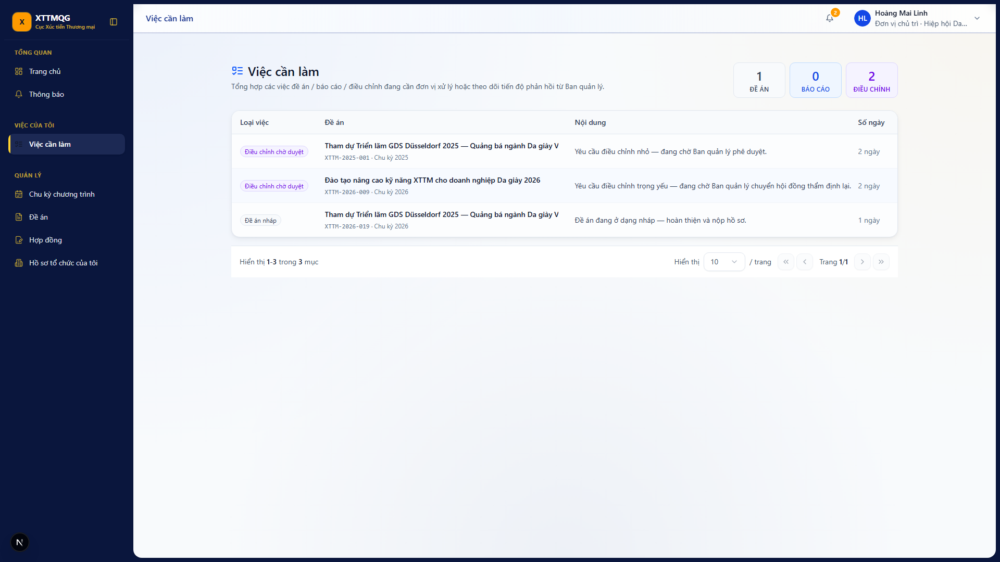
- 

## Bước F.2 — BQL duyệt báo cáo

**Tài khoản**: `banql`

**Thao tác**:

1. Đăng nhập `banql` → menu **Việc của tôi → Báo cáo chờ duyệt**
2. Thấy báo cáo của đơn vị vừa nộp (status `SUBMITTED`)
3. Click → trang xem báo cáo, đọc kỹ các chỉ tiêu, file đính kèm
4. Có 2 lựa chọn:
   - **Duyệt báo cáo** → status `APPROVED`
   - **Trả bổ sung** → ghi lý do (≥10 ký tự) → status `RETURNED`, đơn vị nhận thông báo và sửa nộp lại

**Kết quả mong đợi**: Report `APPROVED`, sẵn sàng cho bước nghiệm thu.

**Ảnh chụp**:

- 
- 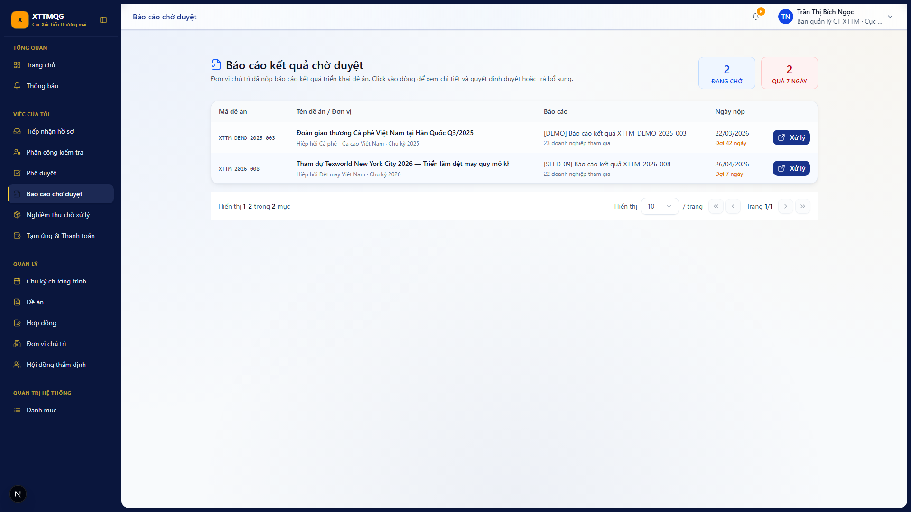

## Bước F.3 — BQL lập biên bản nghiệm thu

**Tài khoản**: `banql`

**Mục tiêu nghiệp vụ**: Sau khi báo cáo được duyệt, BQL lập biên bản nghiệm thu, sinh PDF, ký tay, upload scan.

**Thao tác**:

1. Click menu **Việc của tôi → Nghiệm thu chờ xử lý**
2. Tab "Chờ lập biên bản" → đề án vừa duyệt báo cáo
3. Click → form lập biên bản:
   - Số biên bản: tự sinh `001/BB-NT-XTTM/2026`
   - Ngày lập biên bản
   - Kết quả nghiệm thu: `Đạt / Đạt một phần / Không đạt`
   - Ghi chú đánh giá
4. Bấm **Sinh PDF biên bản** → tải PDF
5. In ra → ký tay → quay lại upload bản scan

**Kết quả mong đợi**: AcceptanceRecord tạo thành công, có scan.

**Ảnh chụp**:

- 
- 

## Bước F.4 — BQL thanh lý hợp đồng

**Tài khoản**: `banql`

**Thao tác**:

1. Tại `/nghiem-thu`, chuyển sang tab "Chờ thanh lý hợp đồng"
2. Click đề án có biên bản nghiệm thu
3. Form thanh lý: ngày thanh lý, ghi chú
4. Sinh PDF biên bản thanh lý → in/ký/upload scan
5. Hệ thống cập nhật `liquidationDate` trên AcceptanceRecord

**Kết quả mong đợi**: HĐ ở status cuối `LIQUIDATED`, đề án rời khỏi queue nghiệm thu.

**Ảnh chụp**:

- 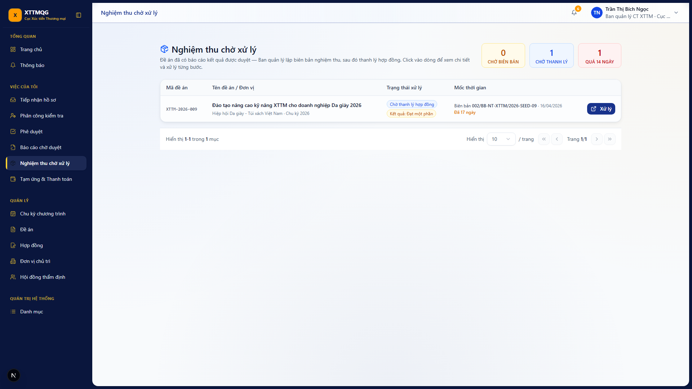

## Bước F.5 — Tài chính phiếu thanh toán cuối + quyết toán

**Tài khoản**: `taichinh`

**Thao tác**:

1. Tab "Thanh toán" → **+ Tạo phiếu thanh toán**
2. Chọn đề án (lọc đã có biên bản nghiệm thu), số tiền = giá trị HĐ – tạm ứng đã chi
3. Trình duyệt → giải ngân
4. Sau đó tab "Quyết toán" → **+ Tạo phiếu quyết toán** tổng kết toàn bộ chi phí của đề án
5. Đính kèm file biên bản đối chiếu

**Kết quả mong đợi**: 3 loại phiếu (ADVANCE / PAYMENT / SETTLEMENT) đều ở status cuối, dashboard tài chính cập nhật.

**Ảnh chụp**:

- 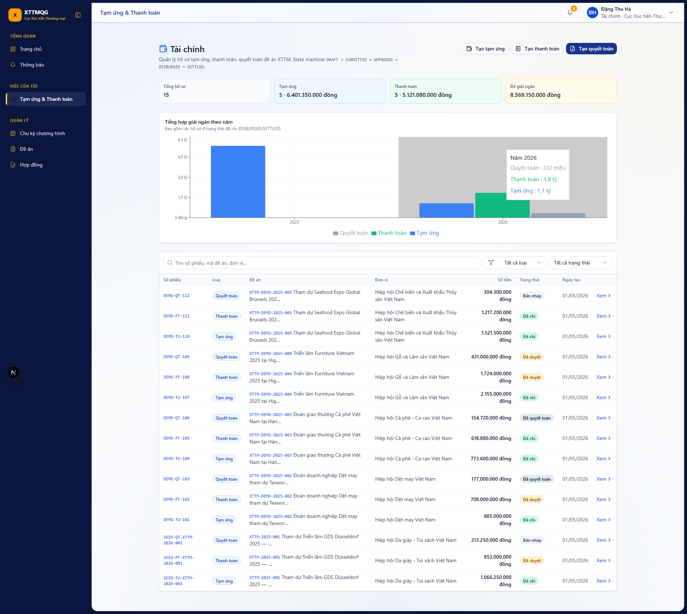
- 
- 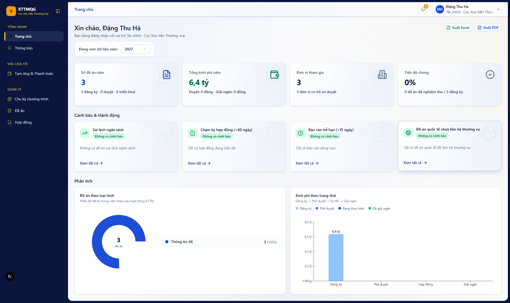

# PHẦN G — DEMO PHỤ TRỢ

## Bước G.1 — Tenant isolation: đơn vị 2 không thấy đề án của đơn vị 1

**Tài khoản**: `donvi2 / Donvi@123` (Hiệp hội Dệt may VN)

**Mục tiêu**: Chứng minh hệ thống cách ly dữ liệu giữa các đơn vị.

**Thao tác**:

1. Đăng nhập `donvi2`
2. Click menu **Quản lý → Đề án**
3. Quan sát: KHÔNG có đề án nào của Hiệp hội Da giày xuất hiện
4. Thử truy cập trực tiếp URL `/de-an/[id-của-da-giay]` → bị redirect về dashboard với thông báo "Không có quyền"

**Kết quả mong đợi**: Tenant isolation hoạt động cả ở UI lẫn URL trực tiếp.

**Ảnh chụp**:

- 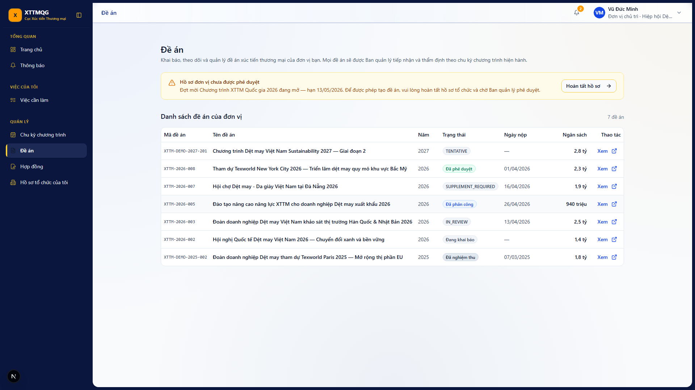
- 

## Bước G.2 — Admin cấu hình ma trận quyền động

**Tài khoản**: `admin / Admin@123`

**Mục tiêu**: Demo khả năng tinh chỉnh phân quyền không cần lập trình.

**Thao tác**:

1. Đăng nhập `admin`
2. Click menu **Quản trị hệ thống → Vai trò & quyền**
3. Trang ma trận quyền dạng grid: hàng = role, cột = resource × action
4. Tick/bỏ tick một vài ô (vd cho HOIDONG quyền `update` trên `tham-dinh`)
5. Bấm **Lưu thay đổi** — confirm dialog hiện diff trước/sau
6. (Tuỳ chọn) bấm **Re-sync from defaults** để khôi phục về matrix gốc

**Kết quả mong đợi**: Quyền cập nhật vào DB ngay, hiệu lực lập tức cho session mới.

**Ảnh chụp**:

- 
- 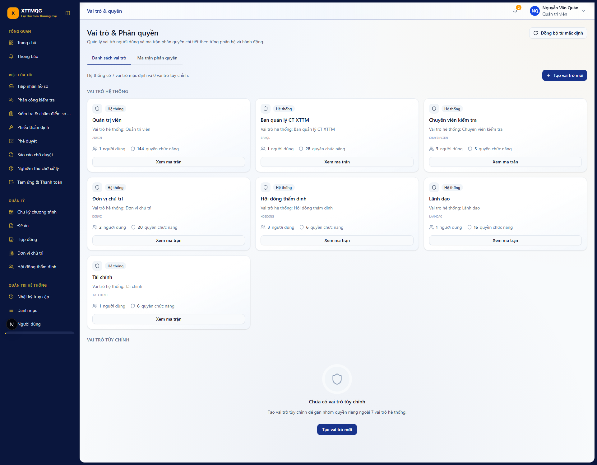

## Bước G.3 — Audit log

**Tài khoản**: `admin`

**Thao tác**:

1. Click menu **Quản trị → Nhật ký truy cập**
2. Bảng audit log hiển thị toàn bộ thao tác trong session demo:
   - banql tạo chu kỳ, mở đăng ký
   - donvi1 nộp đề án
   - chuyenvien chấm điểm
   - lanhdao ký quyết định
   - taichinh giải ngân
3. Filter theo user / resource / action / khoảng thời gian
4. Click 1 dòng → xem chi tiết JSON before/after

**Kết quả mong đợi**: Mọi thao tác quan trọng đều có entry, có user, timestamp, IP, before/after.

**Ảnh chụp**:

- 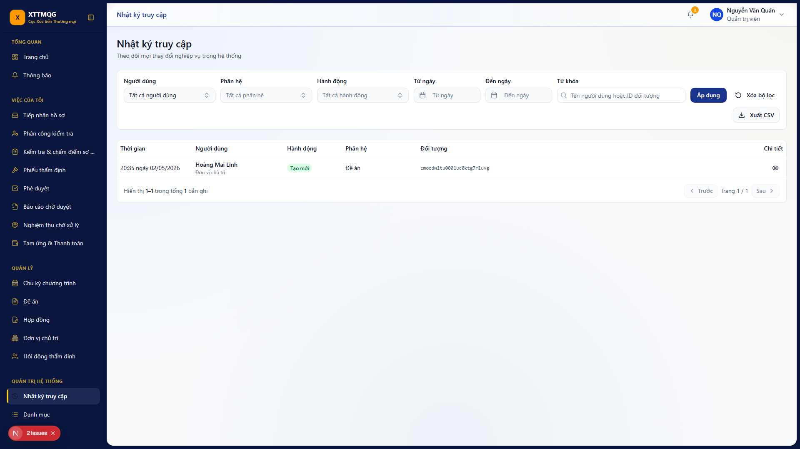
- 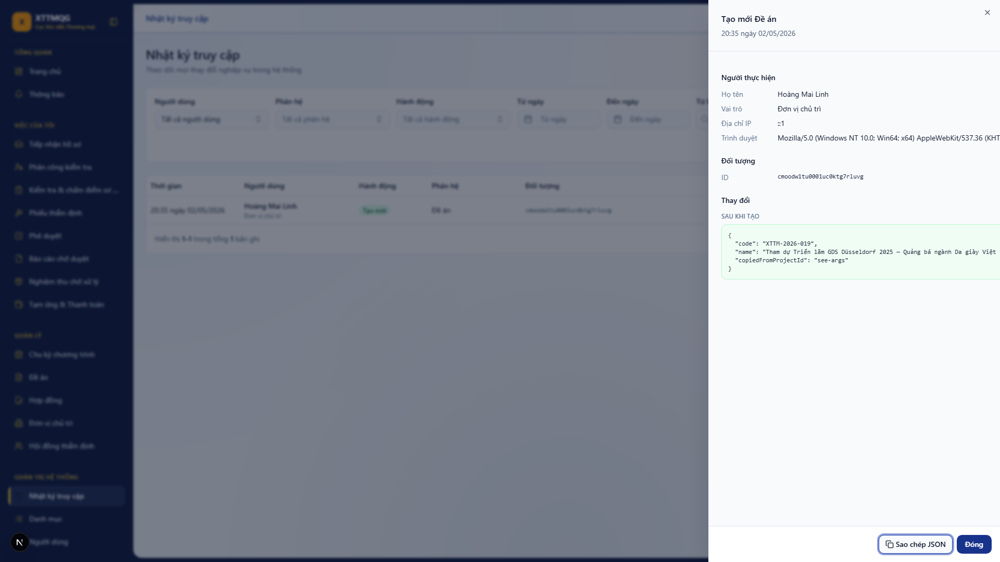

# PHẦN H — KIỂM TRA TỔNG HỢP & QnA

Sau khi chạy hết kịch bản, mở dashboard của LANHDAO để xem các chỉ số tổng hợp:

1. **Đăng nhập `lanhdao`** → `/dashboard`
2. Quan sát các card:
   - Tổng số đề án theo trạng thái
   - Tổng ngân sách duyệt vs đã giải ngân
   - Đề án có cảnh báo SLA (HĐ chậm 60 ngày, BC chậm 15 ngày, thương vụ 30 ngày)
3. Charts: phân bổ ngân sách theo loại đề án, theo ngành hàng

**Ảnh chụp**:
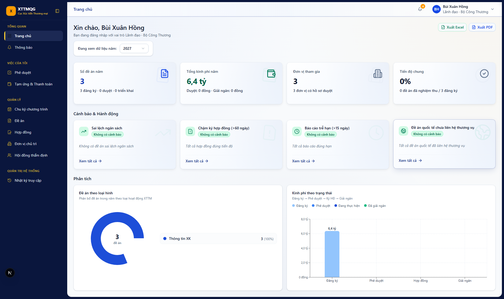

# PHỤ LỤC

## P.1. Danh sách 21 menu của hệ thống

(Xem file `lib/permissions.ts` — đã có đầy đủ với phân quyền theo role)

## P.2. Mapping kịch bản → 27 bước quy trình tổ chức Chương trình XTTM cấp quốc gia

| Bước trong tài liệu nguồn | Bước trong kịch bản |
|---|---|
| Bước 1-3: Phát động chu kỳ | Phần A |
| Bước 4-6: Đơn vị nộp đề án | Phần B |
| Bước 7-9: Tiếp nhận & kiểm tra | Phần C |
| Bước 10-15: Thẩm định & phê duyệt | Phần D |
| Bước 16-18: Hợp đồng & triển khai | Phần E |
| Bước 19-23: Báo cáo kết quả | Phần F (F.1, F.2) |
| Bước 24-27: Nghiệm thu, thanh lý, quyết toán | Phần F (F.3, F.4, F.5) |

## P.3. Cảnh báo SLA được trình diễn

| Cảnh báo | Bước trong kịch bản | Module |
|---|---|---|
| Hạn nộp đề án 30/05 | A.1 (cấu hình) | ProgramCycle |
| 30 ngày trước sự kiện QT phải liên hệ thương vụ | E.2 | Project (impl) |
| 60 ngày sau QĐ phê duyệt mà chưa ký HĐ | E.1 | Contract |
| 15 ngày sau hoạt động phải nộp BC | F.1 | Report |
| 2 tháng sau QĐ nhắc ký HĐ | E.1 | Contract |

> **HẾT KỊCH BẢN**
> Tổng số bước: 22 bước chính + 3 bước phụ trợ = **25 bước**
> Số tài khoản sử dụng: **8** (đầy đủ 7 vai trò + 1 đơn vị thứ 2 cho tenant isolation)
> Số screenshot cần chuẩn bị: ~50 ảnh
